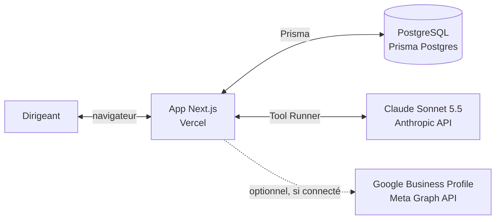
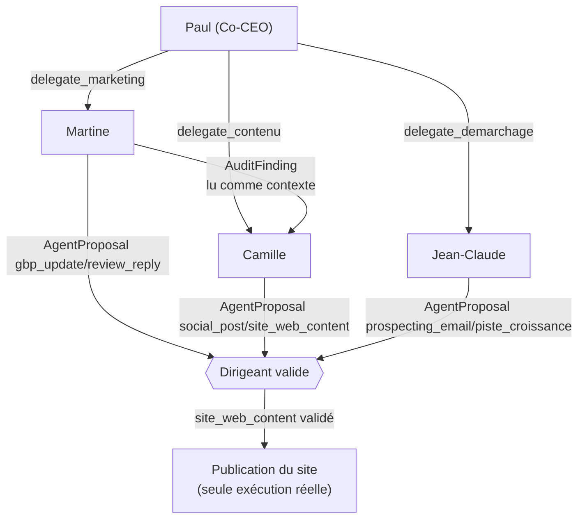
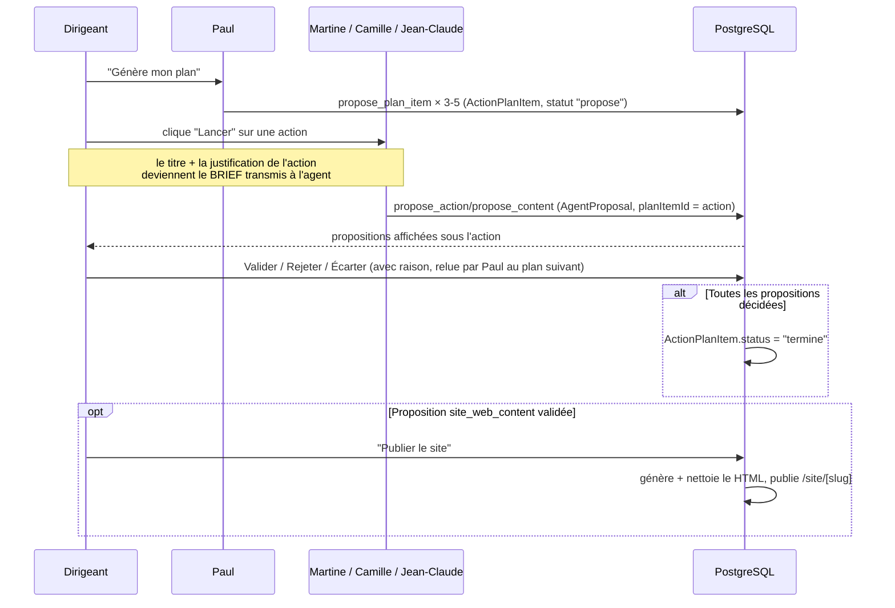
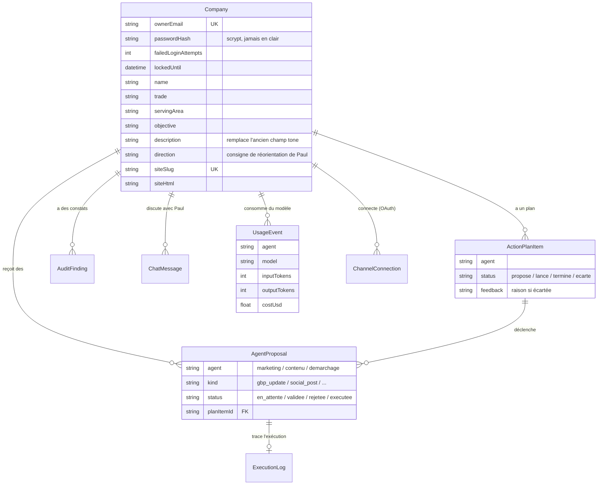
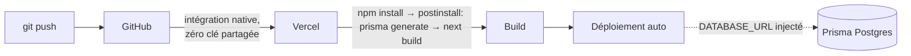

# Architecture Pepito

Document de référence à jour (2026-10-05) — remplace [architecture-technique.md](architecture-technique.md) qui garde la trace de la décision initiale (CTO, avant Postgres/Vercel/réorg agents) à titre historique.

## 1. Vue d'ensemble

Pepito est une application web (Next.js) où un **Co-CEO (Paul)**, orchestré par IA, pilote une petite équipe de **3 agents spécialisés**. Chaque agent **propose** des actions (contenu, diagnostic, pistes commerciales) ; **rien n'est jamais exécuté sans validation explicite du dirigeant**, sauf la publication du site web qui est l'unique exécution automatisée existante aujourd'hui, et seulement sur une proposition déjà validée.

## 2. Stack technique

| Couche | Choix | Pourquoi |
|---|---|---|
| Framework | **Next.js 16** (App Router), TypeScript | Full-stack dans un seul projet (pages + API routes), déploiement natif sur Vercel |
| UI | React + Tailwind CSS v4 | Pas de bibliothèque de composants ajoutée — volontairement minimal |
| Base de données | **PostgreSQL** (Prisma Postgres, hébergé par Vercel) | Seul choix viable pour un hébergement serverless (SQLite ne survit pas à un filesystem éphémère) |
| ORM | **Prisma 7** avec `@prisma/adapter-pg` | Driver adapter explicite (obligatoire depuis Prisma 7 — plus d'URL magique dans le schéma) |
| IA | **Claude Sonnet 5.5** (`claude-sonnet-5-5`) via `@anthropic-ai/sdk`, pattern **Tool Runner** | Un seul modèle partout pour l'instant ; chaque agent définit ses propres outils (function calling), la bibliothèque gère la boucle d'appel |
| Auth | Cookie de session **signé HMAC-SHA256** (`SESSION_SECRET`) + mot de passe haché **scrypt** (natif Node, aucune dépendance) | Corrigé le 2026-10-05 après une faille critique (cookie en clair forgeable) — voir [backlog.md](backlog.md) |
| Hébergement | **Vercel**, déploiement auto sur push GitHub | Zéro configuration CI/CD, intégration GitHub native (aucune clé API partagée) |
| OAuth (optionnel) | Google OAuth2, Meta Graph API | Code prêt, inactif tant que les identifiants ne sont pas fournis (`/connexions` l'indique honnêtement) |

## 3. Logique inter-agents

### 3.1 Rôles et garde-fou commun

| Agent | Rôle | Outils (function calling) | Produit |
|---|---|---|---|
| **Paul** (`co_ceo`) | Point de contact, orchestrateur, "meneur" | `get_current_status`, `delegate_marketing`, `delegate_contenu`, `delegate_demarchage`, `propose_plan_item` | Réponses de chat, plan d'action priorisé (`ActionPlanItem`) |
| **Martine** (`marketing`) | Diagnostic + pilotage de la fiche Google. Jamais de contenu créatif. | `web_fetch`, `web_search`, `record_audit_finding`, `propose_action` (gbp_update, review_reply) | `AuditFinding`, `AgentProposal` |
| **Camille** (`contenu`) | Production créative : posts + site web. S'appuie sur les constats de Martine. | `propose_content` (social_post, site_web_content) | `AgentProposal` |
| **Jean-Claude** (`demarchage`) | Pistes de croissance publiques + templates de prospection générique | `web_search`, `propose_growth_lead`, `propose_prospecting_email` | `AgentProposal` |

**Garde-fou non négociable, commun à tous** : chaque outil d'agent **écrit en base** (`create`), il n'appelle **jamais** une API externe. L'exécution réelle est un code séparé (`src/lib/site/publish.ts` aujourd'hui, seule exécution existante), déclenché uniquement sur une proposition déjà `validee`.

### 3.2 Orchestration par Paul

Camille ne reçoit pas les constats de Martine via un mécanisme de handoff dédié : elle lit simplement les derniers `AuditFinding` en base au moment de son propre run (même table, pas de couplage de code entre les deux agents).

### 3.3 Boucle plan → action → proposition → validation

C'est le parcours central de l'application (page **Aujourd'hui**, anciennement "dashboard") :

Mode manuel (page **Équipe**) : même logique, mais sans passer par le plan — chaque agent est lancé directement, sans brief imposé.

## 4. Modèle de données (entités clés)

**Isolation entre entreprises** : toute route API dérive l'entreprise de la session (`getSessionCompany()`), jamais d'un `companyId` fourni par le client — corrigé après audit le 2026-10-05 (cf. [backlog.md](backlog.md)).

## 5. Sécurité — état actuel

| Sujet | État |
|---|---|
| Session | Cookie signé HMAC-SHA256, vérifié à temps constant (`timingSafeEqual`) |
| Mots de passe | Hachés scrypt + sel, jamais stockés ni renvoyés au client (`omitPasswordHash` systématique) |
| Force brute | 5 échecs → verrouillage 15 min, stocké en base (valable entre instances serverless) |
| Isolation multi-tenant | Toutes les routes vérifient l'appartenance via la session, pas via un ID client |
| Contenu généré (site) | HTML nettoyé (scripts/handlers retirés) + servi dans une `<iframe sandbox="">` sans droits |
| OAuth | Jamais de mot de passe tiers collecté — flux OAuth officiel uniquement (Google/Meta) |
| Admin (`/admin`) | **Ouvert par défaut** à tout utilisateur connecté (décision CEO le 2026-10-05) — à refermer via `ADMIN_EMAILS` avant tout client externe non trié sur le volet |

## 6. Déploiement

Variables d'environnement requises en production : `DATABASE_URL` (auto-injectée par l'intégration Postgres de Vercel), `ANTHROPIC_API_KEY`, `SESSION_SECRET`. Optionnelles : `GOOGLE_OAUTH_*`, `META_*`, `ADMIN_EMAILS`. Détail pas-à-pas dans le [README](../README.md).

## 7. Limites connues (volontaires, pas des oublis)

- **Un seul modèle** (`claude-sonnet-5-5`) partout — choix de coût assumé, à réévaluer par cas si la qualité ne suffit pas (cf. [architecture-technique.md](architecture-technique.md)).
- **Pas de tests automatisés** — plusieurs régressions (fiabilité Martine, fuite `passwordHash`, route morte après renommage) n'ont été trouvées que par tests manuels. Identifié comme priorité P2 dans le backlog.
- **Pas de monitoring d'erreurs** dédié (Sentry ou équivalent) — seuls les logs serveur Vercel existent aujourd'hui.
- **OAuth non fonctionnel** tant que les identifiants Google/Meta ne sont pas fournis (démarche externe, cf. [oauth-setup.md](oauth-setup.md)).

Pour le détail complet des décisions prises et de ce qui reste à faire, voir [backlog.md](backlog.md).

